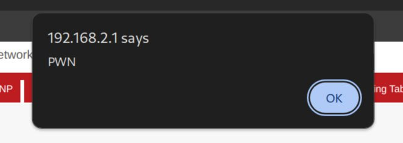

# Multiple stored XSS issues (CVE-2024-48417)

## Summary
We identified different stored Cross-Site Scripting (XSS) vulnerabilities affecting multiple web UI pages. Specifically, these issues can be triggered each time the user input is returned by the pages. As an example, the following pages expose the described misbehavior:
- `/goform/setStaticRoute`
- `/goform/fromSetFilterUrlFilter`
- `/goform/fromSetFilterClientFilter`

Each of these vulnerabilities allows an attacker with access to the web interface to inject and execute arbitrary JavaScript payloads.

As a side note, since the device does not implement any anti-CSRF mechanism, these issues could be exploited remotely through CSRF techniques.

## Affected products
* Edimax dual band 5 Wi-Fi AC1200 BR-6476AC (firmware BR-6476AC\_1.06)

## Details
According to the device vendor, this product is now out of support and no security patches will be provided. For this reason, details on how to reproduce the vulnerability are deliberately omitted.

## PoC

## Impact
By exploiting any of these vulnerabilities it is possible to execute arbitrary scripts in the context of the victim's browser, potentially allowing to steal sensitive information and compromising the integrity and confidentiality of user data. Please note that, since the device does not implement any anti-CSRF mechanism, these issues could be exploited remotely through CSRF techniques.

## Additional information

### Credit
Spike Reply Cybersecurity Team

### Disclosure timeline
- July 18, 2024: Initial vendor contact
- August 9, 2024: Vulnerability acknowledged by device vendor, but no fix will be implemented as the device is out of support
- November 5, 2024: Disclosure
