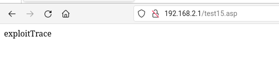
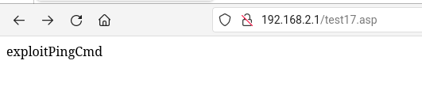

# Multiple command injections in /bin/goahead (CVE-2024-48419) #

## Summary
We identified multiple command injection vulnerabilities affecting the binary application `/bin/goahead`, on Edimax Router dual band 5 Wi-Fi AC1200 BR-6476AC device, on firmware version BR-6476AC\_1.06. This application implements multiple web UI pages, and specifically, the abovementioned issues can be triggered through the following pages:

1. `/goform/tracerouteDiagnosis`
2. `/goform/pingDiagnosis`
3. `/goform/fromSysToolPingCmd`

Each of these issues allows an attacker with access to the web interface to inject and execute arbitrary shell commands, with "root" privileges. As a side note, since the device does not implement any anti-CSRF mechanism, these issues could be exploited remotely through CSRF techniques.

## Affected products
* Edimax dual band 5 Wi-Fi AC1200 BR-6476AC (firmware BR-6476AC\_1.06)

## Details
According to the device vendor, this product is now out of support and no security patches will be provided. For this reason, details on how to reproduce the vulnerability are deliberately omitted.

## PoC
1. By executing the malicious payload, it was possible to execute the bash command `echo` in the underlying system and create a new web page at the path `http://<hostname>/test15.asp`.

2. By executing the malicious payload, it was possible to execute the bash command `echo` in the underlying system and create a new web page at the path `http://<hostname>/test16.asp`.

3. By executing the malicious payload, it was possible to execute the bash command `echo` in the underlying system and create a new web page at the path `http://<hostname>/test17.asp`.

## Impact
Each of these issues allows an attacker with access to the web interface to inject and execute arbitrary shell commands, with `root` privileges. Please note that, since the device does not implement any anti-CSRF mechanism, these issues could be exploited remotely through CSRF techniques.

## Additional information

### Credit
Spike Reply Cybersecurity Team

### Disclosure timeline
- July 18, 2024: Initial vendor contact
- August 9, 2024: Vulnerability acknowledged by device vendor, but no fix will be implemented as the device is out of support
- November 5, 2024: Disclosure
