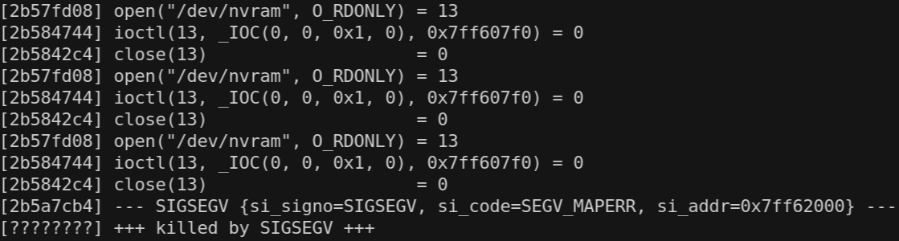

# Buffer overflow in getWifiBasic (CVE-2024-48420) #

## Summary
We identified a Buffer overflow vulnerability on Edimax Router dual band 5 Wi-Fi AC1200 BR-6476AC device, on firmware version BR-6476AC\_1.06. The GET request `/goform/getWifiBasic` does not properly handle the length of one of the input parameters (which can be in turn controlled through another web UI page) allowing an attacker with access to the web interface to cause denial of service or, in the worst case, execute arbitrary commands.

As a side note, since the device does not implement any anti-CSRF mechanism, present issue could be exploited remotely through CSRF techniques.

## Affected products
* Edimax dual band 5 Wi-Fi AC1200 BR-6476AC (firmware BR-6476AC\_1.06)

## Details
According to the device vendor, this product is now out of support and no security patches will be provided. For this reason, details on how to reproduce the vulnerability are deliberately omitted.

## PoC
To exploit the issue is required to perform two requests:
1. The first one is for storing the malicious value in the device configuration.
2. The second request is used to force the device to read the overloaded buffer and trigger the overflow.

## Impact
By exploiting this vulnerability it could be possible to alter the normal behavior of the web server that hosts the management GUI of the router, and possibly achieve arbitrary code execution. Please note that, since the device does not implement any anti-CSRF mechanism, present issue could be exploited remotely through CSRF techniques.

## Additional information

### Credit
Spike Reply Cybersecurity Team

### Disclosure timeline
- July 18, 2024: Initial vendor contact
- August 9, 2024: Vulnerability acknowledged by device vendor, but no fix will be implemented as the device is out of support
- November 5, 2024: Disclosure
