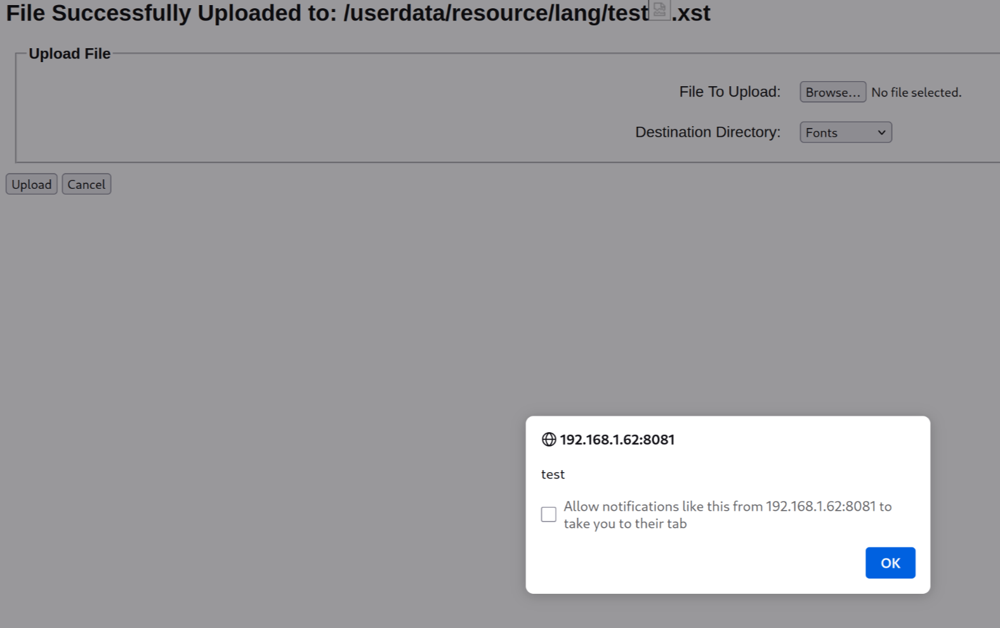

# Cross-Site scripting (XSS) reflected in upload page (CVE-2025-64054)
## Summary
We identified a reflected Cross-Site scripting vulnerability in the web UI of Fanvil x210 device, on firmware version `X210-V2-2.12.20`. The POST request `/cgi-bin/webconfig?page=upload&action=submit` does not properly handle special characters in the `filename` parameter, allowing an attacker with access to the web interface to inject and execute JavaScript code.

## Affected products
- Fanvil x210 V2, firmware V2.12.20

## Details
The POST parameter `filename` should contain a name of the new uploaded file on the device. If JavaScript code is inserted this field, it is reflected and executed. Note that the since the character `/` is interpreted by the CGI script as separator between path and filename, `<script>` tags seem to not be interpreted. In order execute JS code, we used the following payload: ``.

## PoC
```http
POST /cgi-bin/webconfig?page=upload&action=submit HTTP/1.1
Host: 192.168.1.62:8081
User-Agent: Mozilla/5.0 (X11; Linux x86_64; rv:136.0) Gecko/20100101 Firefox/136.0
Accept: text/html,application/xhtml+xml,application/xml;q=0.9,*/*;q=0.8
Accept-Language: en-US,it;q=0.7,en;q=0.3
Accept-Encoding: gzip, deflate, br
Content-Type: multipart/form-data; boundary=----geckoformboundary63e8985605603550ed6eb59d5b6663f0
Content-Length: 410
Origin: http://192.168.1.62:8081
Connection: keep-alive
Referer: http://192.168.1.62:8081/cgi-bin/webconfig?page=upload
Upgrade-Insecure-Requests: 1
Priority: u=4

------geckoformboundary63e8985605603550ed6eb59d5b6663f0
Content-Disposition: form-data; name="upload/newfile"; filename="test.xst"
Content-Type: application/octet-stream

test

------geckoformboundary63e8985605603550ed6eb59d5b6663f0
Content-Disposition: form-data; name="upload/dest"

/userdata/resource/lang
------geckoformboundary63e8985605603550ed6eb59d5b6663f0--
```



## Additional information
Issue fixed on firmware version 2.12.22.2

## Credits
Spike Reply Cybersecurity Team

## Disclosure timeline
- 01/03/2025: Vulnerability discovered
- 04/03/2025: Initial contact with vendor
- 06/03/2025: Technical details shared with vendor
- 25/04/2025: Disclosure date agreed with vendor (June 6, 2025)
- 14/05/2025: Vendor reports inability to reproduce this and other reported issues
- 06/06/2025: Team informs vendor they are retesting on firmware v2.12.22.2, released after initial contact (April 28, 2025)
- 09/06/2025: Vendor investigates whether web server changes in new firmware address the issues
- 25/06/2025: Team requests update - no response
- 07/07/2025: Follow-up request sent - still no response
- 16/07/2025: Team sends another follow-up and sets new disclosure date (July 28, 2025) - no response
- 25/11/2025: Disclosure
