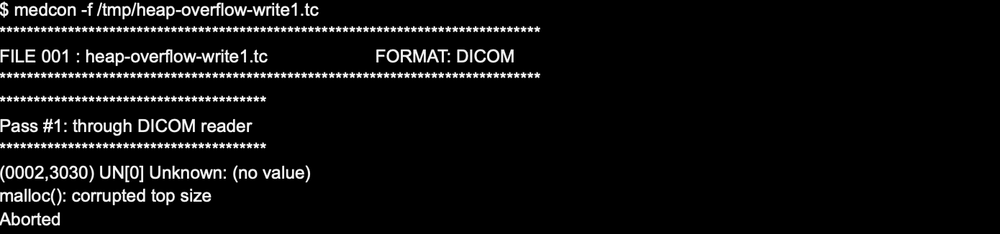

# xmedcon: Heap overview on when parsing DICOM medical files (CVE-2024-29421)

## Summary
We identified a heap-based buffer overflow vulnerability in xmedcon. Attackers can abuse this issue to write into a dynamically-allocated memory buffer, overflowing into adjacent data chunks.

## Affected products
- xmedcon (before version 0.24.0)

## Details

The root cause of the vulnerability can be ascribed to the following code snipped (from `dicom_load()`, located in `libs/dicom/basic.c`), triggered when parsing UN elements from the input DICOM file:

```
  if (!element.length)
	element.value.UN=0L;
  else
  {
	element.value.UN=malloc(element.length + 4); [1]
	if (!element.value.UN)
	{
	...
	}
	memset(element.value.UN,0,element.length + 4);
	r = fread(element.value.UN,1,element.length,stream); [2]
	if (r != element.length) {
	  eNlfSafeFree(element.value.UN);
	  if (dicom_check(0)) return -3;
	}
```

At [1] code allocates "element.length+4" bytes on the heap, where "element.length" is attacker-controlled. However, if element.length is close to `UINT_MAX` (e.g., 0xfffffffe) the sum overflows `UINT_MAX`, resulting in the allocation of a "small" heap chunk (i.e., between 1 and 3 bytes). Later, at [2] code reads "element.length" bytes from the input stream, into the "small" heap-based buffer. This allows the attacker to overflow the heap chunk, and overwrite heap memory allocator metadata, possibly achieving code execution.

## PoC

See file `heap-overflow-write1.tc`.



### Credit
Spike Reply Cybersecurity Team

### Acknowledgments
Thanks to xmedcon author (Erik Nolf) for his support with the disclosure of this issue.

### References
- https://cve.mitre.org/cgi-bin/cvename.cgi?name=CVE-2024-29421
- https://xmedcon.sourceforge.io/

### Disclosure timeline ##
- February 27, 2024: Initial contact
- March 10, 2024: Shared vulnerability details
- March 12, 2024: Received confirmation from xmedcon author
- May 22, 2024: Disclosure
